# Artist Songs System & Spotify Signup - Respect Uygulaması

Bu dokümantasyon, Respect uygulamasına eklenen yeni sanatçı şarkıları sistemini ve Spotify hesabı ile kayıt olma özelliğini açıklar.

## 🎯 Sistem Amacı

Respect uygulamasına giriş yapmış kişiler için:
- **Sanatçı ise**: Spotify'da yayınladığı kendi şarkıları çekilerek profil sayfasında gösterilir
- **Sanatçı değilse**: Mevcut sistem gibi kendi Spotify playlist verileri çekilir

## 🏗️ Sistem Mimarisi

### 1. Veritabanı Katmanı

#### Yeni Migration Dosyası
- `supabase/migrations/20250101000013_add_artist_songs_detection.sql`

#### Eklenen Yapılar
- **Views**: `user_artist_status`, `user_own_artist_songs`, `user_playlist_songs`
- **Functions**: `get_user_artist_songs()`, `get_user_playlist_songs()`, `is_user_artist()`
- **Indexes**: Performans optimizasyonu için gerekli indeksler

#### Veritabanı Fonksiyonları

```sql
-- Kullanıcının sanatçı olup olmadığını kontrol et
SELECT is_user_artist('user-uuid-here');

-- Sanatçı ise kendi şarkılarını getir
SELECT * FROM get_user_artist_songs('user-uuid-here');

-- Sanatçı değilse playlist şarkılarını getir
SELECT * FROM get_user_playlist_songs('user-uuid-here');
```

### 2. API Katmanı

#### Güncellenen Servisler
- `src/api/userService.js` - Yeni fonksiyonlar eklendi
- `src/api/spotifyService.js` - Spotify entegrasyonu genişletildi

#### Yeni API Endpoints

```javascript
// Kullanıcının sanatçı olup olmadığını kontrol et
const isArtist = await userService.isUserArtist(userId);

// Sanatçı şarkılarını getir
const artistSongs = await userService.getUserArtistSongs(userId, limit);

// Playlist şarkılarını getir
const playlistSongs = await userService.getUserPlaylistSongs(userId, limit);
```

### 3. Frontend Katmanı

#### Yeni Component
- `src/components/UserArtistSongs.jsx` - Sanatçı/Playlist şarkılarını gösterir

#### Güncellenen Component
- `src/components/UserPage.jsx` - Yeni component entegre edildi

#### CSS Stilleri
- `src/App.css` - Yeni component için responsive tasarım

## 🚀 Kurulum Adımları

### 1. Veritabanı Migration'ları Çalıştır

```bash
# Supabase CLI ile migration'ları çalıştır
supabase db push

# Veya SQL dosyalarını manuel olarak çalıştır
psql -h your-host -U your-user -d your-db -f supabase/migrations/20250101000013_add_artist_songs_detection_simple.sql
psql -h your-host -U your-user -d your-db -f supabase/migrations/20250101000014_add_spotify_signup_system.sql
```

### 2. Frontend Güncellemelerini Kontrol Et

```bash
# Yeni component'lerin doğru import edildiğini kontrol et
npm run build

# Development server'ı başlat
npm run dev
```

### 3. Test Et

```bash
# Test dosyasını çalıştır
node test_artist_songs_system.js
```

## 🔧 Konfigürasyon

### Environment Variables

```env
# Spotify API (zaten mevcut)
VITE_SPOTIFY_CLIENT_ID=your_client_id
VITE_SPOTIFY_CLIENT_SECRET=your_client_secret
VITE_SPOTIFY_REDIRECT_URI=your_redirect_uri

# Supabase (zaten mevcut)
VITE_SUPABASE_URL=your_supabase_url
VITE_SUPABASE_ANON_KEY=your_supabase_anon_key
```

### Spotify Scopes

Yeni sistem için gerekli Spotify izinleri:
- `user-read-private` - Kullanıcı profil bilgileri
- `user-top-read` - Kullanıcının top şarkıları
- `playlist-read-private` - Özel playlist'ler
- `playlist-read-collaborative` - İşbirlikçi playlist'ler

## 📱 Kullanıcı Deneyimi

### Sanatçı Kullanıcılar İçin
- Profil sayfasında "Kendi Şarkılarım" bölümü
- Her şarkıda 🎵 rozeti ile sanatçı olduğu belirtilir
- Şarkılar respect sayısına göre sıralanır
- Yayın tarihi bilgisi gösterilir

### Normal Kullanıcılar İçin
- Profil sayfasında "Playlist Şarkılarım" bölümü
- Spotify playlist'lerinden çekilen şarkılar
- Şarkılar respect sayısına göre sıralanır

## 🔍 Sistem Akışı

```mermaid
graph TD
    A[Kullanıcı Giriş Yapar] --> B{Sanatçı mı?}
    B -->|Evet| C[Spotify'dan Kendi Şarkılarını Çek]
    B -->|Hayır| D[Spotify'dan Playlist Şarkılarını Çek]
    C --> E[Veritabanına Kaydet]
    D --> F[Veritabanına Kaydet]
    E --> G[Profil Sayfasında Göster]
    F --> G
    G --> H[Kullanıcı Şarkıları Görür]
```



## 🧪 Test Etme

### Manuel Test
1. Sanatçı hesabı ile giriş yap
2. Profil sayfasında "Kendi Şarkılarım" bölümünü kontrol et
3. Normal hesap ile giriş yap
4. Profil sayfasında "Playlist Şarkılarım" bölümünü kontrol et

### Otomatik Test
```bash
# Test suite'ini çalıştır
npm test

# Belirli test'i çalıştır
npm test -- --grep "Artist Songs"
```

## 🐛 Sorun Giderme

### Yaygın Hatalar

#### 1. "Function not found" Hatası
```sql
-- Migration'ın çalıştırıldığından emin ol
SELECT * FROM information_schema.routines 
WHERE routine_name = 'is_user_artist';
```

#### 2. "Permission denied" Hatası
```sql
-- RLS politikalarını kontrol et
SELECT * FROM pg_policies WHERE tablename = 'user_artist_status';
```

#### 3. Spotify API Limit Hatası
- Rate limiting için exponential backoff implement et
- API çağrılarını cache'le

### Debug Logları

```javascript
// Console'da debug log'ları aktif et
localStorage.setItem('debug', 'artist-songs:*');

// API çağrılarını izle
console.log('🎭 Artist detection:', result);
console.log('🎵 Songs fetched:', songs);
```

## 📈 Performans Optimizasyonları

### Veritabanı
- Composite index'ler eklendi
- View'lar materialize edilebilir
- Connection pooling kullan

### Frontend
- Lazy loading implement edildi
- Virtual scrolling büyük listeler için
- Image optimization

### API
- Response caching
- Batch requests
- Pagination

## 🔮 Gelecek Geliştirmeler

### Kısa Vadeli
- [ ] Real-time şarkı güncellemeleri
- [ ] Şarkı detay sayfaları
- [ ] Respect gönderme entegrasyonu

### Orta Vadeli
- [ ] Çoklu platform desteği (Apple Music, YouTube Music)
- [ ] Şarkı analitikleri
- [ ] Otomatik şarkı senkronizasyonu

### Uzun Vadeli
- [ ] AI-powered şarkı önerileri
- [ ] Sosyal özellikler (şarkı paylaşımı)
- [ ] Monetizasyon entegrasyonu

## 📚 Referanslar

- [Supabase RLS Documentation](https://supabase.com/docs/guides/auth/row-level-security)
- [Spotify Web API](https://developer.spotify.com/documentation/web-api/)
- [React Best Practices](https://react.dev/learn)
- [CSS Grid Layout](https://developer.mozilla.org/en-US/docs/Web/CSS/CSS_Grid_Layout)

## 🤝 Katkıda Bulunma

1. Fork yap
2. Feature branch oluştur (`git checkout -b feature/amazing-feature`)
3. Commit yap (`git commit -m 'Add amazing feature'`)
4. Push yap (`git push origin feature/amazing-feature`)
5. Pull Request oluştur

## 📄 Lisans

Bu proje MIT lisansı altında lisanslanmıştır. Detaylar için `LICENSE` dosyasına bakın.

## 📞 İletişim

- **Proje Linki**: [GitHub Repository](https://github.com/your-username/respect)
- **Issues**: [GitHub Issues](https://github.com/your-username/respect/issues)
- **Discussions**: [GitHub Discussions](https://github.com/your-username/respect/discussions)

---

**Not**: Bu sistem, mevcut Respect uygulamasına entegre edilmiştir ve geriye dönük uyumluluğu korur.

## 🆕 Spotify Signup Sistemi

### Sistem Özellikleri

- **Otomatik Hesap Oluşturma**: Spotify ile giriş yapan kullanıcılar için otomatik hesap oluşturulur
- **Seamless Integration**: Mevcut kullanıcılar için otomatik giriş yapılır
- **Profile Sync**: Spotify profil bilgileri otomatik olarak senkronize edilir
- **Secure Authentication**: Güvenli token yönetimi ve RLS politikaları

### Veritabanı Yapısı

#### Yeni Tablolar
- `spotify_auth_users` - Spotify ile kayıt olan kullanıcılar
- `user_spotify_profiles` - Spotify profil bilgileri

#### Yeni Fonksiyonlar
- `create_user_from_spotify()` - Spotify'dan yeni kullanıcı oluşturur
- `check_spotify_user_exists()` - Kullanıcının var olup olmadığını kontrol eder
- `update_spotify_user_info()` - Kullanıcı bilgilerini günceller

### Frontend Bileşenleri

#### Yeni Component'ler
- `SpotifyLogin.jsx` - Spotify ile giriş butonu
- `SpotifyCallback.jsx` - OAuth callback handler

#### Güncellenen Servisler
- `spotifyAuthService.js` - Spotify authentication logic
- `spotifyService.js` - OAuth URL ve token yönetimi

### OAuth Flow

1. **Kullanıcı Spotify ile giriş yapar**
2. **Spotify OAuth popup açılır**
3. **Authorization code alınır**
4. **Kullanıcı var mı kontrol edilir**
5. **Yeni kullanıcı oluşturulur veya mevcut kullanıcı giriş yapar**
6. **Spotify bağlantısı kurulur**
7. **Kullanıcı oturum açmış olur**

### Güvenlik Özellikleri

- **Row Level Security (RLS)**: Her kullanıcı sadece kendi verilerine erişebilir
- **Token Encryption**: Access ve refresh token'lar güvenli şekilde saklanır
- **User Isolation**: Kullanıcılar birbirlerinin verilerine erişemez
- **Secure Password Generation**: Spotify user ID'den güvenli şifre oluşturulur

### Test Etme

```bash
# Spotify Signup sistemini test et
node test_spotify_signup_system.js
```
